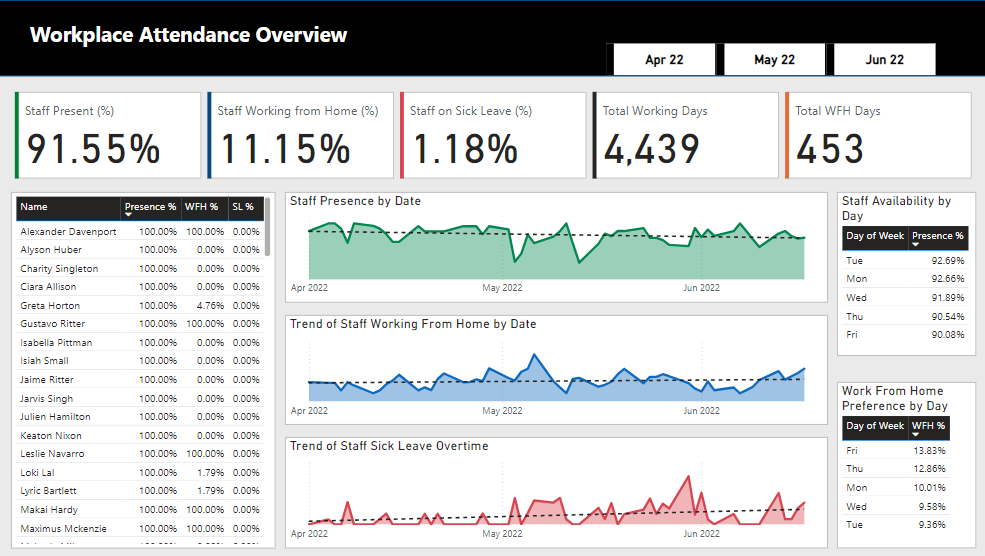

# About Me
I’m a detail-oriented and results-driven Data Analyst with over two years of experience transforming complex datasets into actionable insights that empower smarter decisions.

With a passion for solving problems through data, I excel in using tools like Microsoft Excel, Google Sheets, SQL, Power BI, and Python to uncover trends, craft compelling visualizations, and streamline workflows through automation.

I thrive at the intersection of curiosity and strategy, consistently delivering data solutions that not only answer questions but also inspire new opportunities for growth.

# Projects

### Workplace Attendance Analysis

This project analyzes workforce attendance patterns to enhance management and operational efficiency. Using Power BI and DAX, I developed an interactive dashboard showcasing key metrics like attendance rates, remote work trends, and sick leave percentages. Insights revealed trends such as higher attendance on Tuesdays and areas of concern like low presence among remote employees. The dashboard equips management with actionable insights to optimize policies and planning.

**Tools Used**: Microsoft Excel, Power BI

[View Full Project](https://github.com/danielodey/workplace-analysis-power-bi)

### Shop Smart Customer Analysis

This project explores customer behavior on ShopSmart Inc., an e-commerce platform, using data from five key datasets. Analysis revealed insights like peak activity hours (midnight to 6 am), a low conversion rate of 5.5%, and high transaction failure rates (66.7%). Recommendations include expanding product offerings, optimizing the payment process, and enhancing customer retention strategies in top-performing regions like South Korea. These actionable insights aim to drive customer satisfaction and sales growth.

**Tools Used**: Python, Jupyter Notebook

[View Full Project](https://github.com/danielodey/shop-smart-analysis)

### Web Scrapping project

This project involves web scraping and cleaning football player data from the 2024-2025 Premier League season using Python. Key details, such as player names, teams, dates of birth, heights, and positions, were extracted from worldfootball.net and cleaned with pandas. The data underwent processes like handling missing values, standardizing formats, and was finally exported as a CSV file for further analysis or applications.

**Tools Used**: Python, Jupyter Notebook, Beautiful Soup

[View Full Project](https://github.com/danielodey/player-data-scrapper)

# Contact Me

